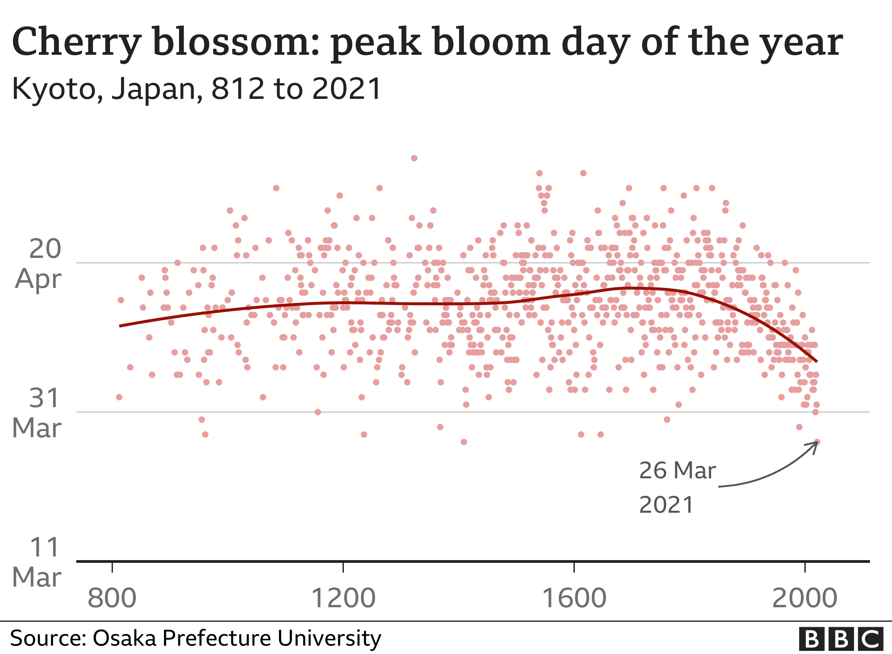

```{r setup, include=FALSE}
knitr::opts_chunk$set(echo = TRUE, message=FALSE, warning=FALSE,
                      comment="", digits = 3, tidy = FALSE, prompt = FALSE, fig.align = 'center')
```

# BBC 뉴스기사 {#bbc-news-letter}

BBC [Japan's cherry blossom 'earliest peak since 812'](https://www.bbc.com/news/world-asia-56574142) 기사에 따르면 일본에서 벗꽃 개화시기를 기록한 812년 이후 올해가 가장 개화시기가 빠르다고 한다.

{width="442"}


# 벗꽃 개화 데이터 {#cherry-blossom-data}

일본 벗꽃 개화 데이터는 [Historical Series of Phenological data for Cherry Tree Flowering at Kyoto City](http://atmenv.envi.osakafu-u.ac.jp/aono/kyophenotemp4/) 웹사이트에서 얻을 수 있다. 

```{r get-data}

library(tidyverse)
library(rvest)

osaka_url <- "http://atmenv.envi.osakafu-u.ac.jp/aono/kyophenotemp4/"

cb_text <- osaka_url %>% 
  read_html() %>% 
  html_nodes(xpath = '//*[@id="main"]/article/div[2]/pre') %>% 
  html_text()

cb_dat <- tibble(txt = cb_text)

cb_tbl <- cb_dat %>% 
  mutate(text = str_split(txt, pattern = "\r\n")) %>% 
  unnest(text) %>% 
  select(text) %>% 
  filter(str_detect(text, "^4")) %>% 
  mutate(split_text = str_split(text, pattern = " +")) %>% 
  mutate(STNNo = map_chr(split_text, 1),
         AD    = map_chr(split_text, 2),
         FiFD  = map_chr(split_text, 3),
         FuFD  = map_chr(split_text, 4)) %>% 
  select(AD, FuFD) %>% 
  mutate(AD = as.integer(AD))
 
cb_tbl %>% 
  arrange(desc(AD)) %>% 
  reactable::reactable()
```

# EDA 시각화 [^2] {#eda-visualization}

[^2]: [CHRISTOPH SAFFERLING (2017-04-11), "Sakura blossoms in Japan", Opiate for the masses: Data is our religion.](http://opiateforthemass.es/articles/sakura/)

블로그 글을 참고하여 데이터 전처리 작업을 하고 벚꽃 이모지를 사용해서 ggplot에 반영한다.

```{r eda-tidyverse}
library(lubridate)
library(emojifont)

cb_tbl <- cb_tbl %>% 
  mutate(month = str_sub(FuFD, 1,2),
         day   = str_sub(FuFD, 3,4)) %>% 
  mutate(date = make_date(year = 2000, month = month, day = day))

cb_gg <- cb_tbl %>%
  mutate(sakura_emoji = emoji("cherry_blossom")) %>% 
  ggplot(aes(x = as.numeric(AD), y = date,
             text = paste('연도 :', AD, "\n",
                          '날짜:', glue::glue("{month}월 {day}일")))) +
    geom_point(size = 0.1) +
    geom_text(aes(label = sakura_emoji, hjust = 0.5, vjust = 0.25),
              family = "EmojiOne", size = 4, colour = "#FF506E") +
    scale_y_date(
      breaks = c("2000-03-27", "2000-04-01", "2000-04-10", "2000-04-20", "2000-05-01", "2000-05-04") %>% as.Date(),
      labels = scales::date_format("%b-%d")) +
    scale_x_continuous(
      limits = c(800, 2020),
      breaks = seq(800, 2000, 100),
      labels = replace(seq(800, 2000, 100), seq(2, 12, 2), "")) +
    theme_bw() +
    labs(x        = "", 
         y        = "벚꽃 만개일",
         title    = "벚꽃 개화일을 통한 벚꽃 개화일",
         subtitle = "일본 교토 서기 800년부터 2021년 까지") +
    geom_smooth(method = "loess", span = 0.1, colour = "black", size = 3.5)  


cb_gg
```

이번에는 인터랙티브 그래프로 시각화해본다.

```{r eda-tidyverse-plotly}
library(plotly)

ggplotly(cb_gg, tooltip = "text")
```