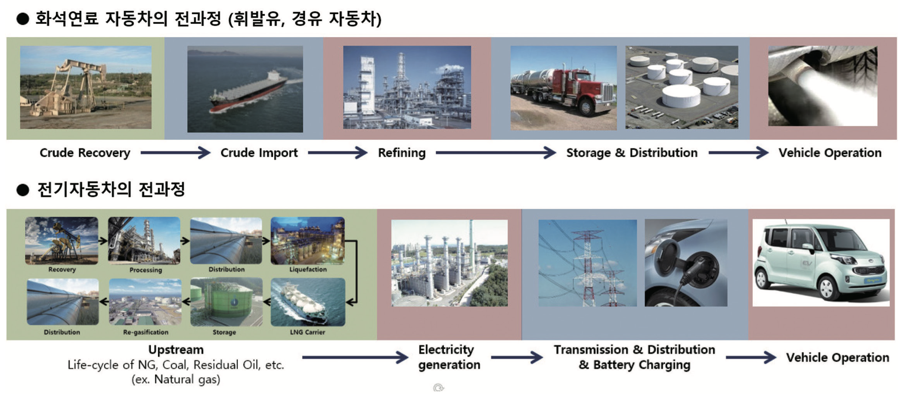

```{r setup, include=FALSE}
knitr::opts_chunk$set(echo = TRUE, message=FALSE, warning=FALSE,
                      comment="", digits = 3, tidy = FALSE, prompt = FALSE, fig.align = 'center')
```


```{=html}
<style>
div.blue { background-color:#e6f0ff; border-radius: 5px; padding: 10px;}
</style>
```


# 성남시 연료별 차량 데이터 {#성남시-연료별-등록현황}

엑셀에서 데이터를 가져와서 후속 데이터 분석이 가능하도록 전처리 작업을 수행한다.

```{r read-excel}
library(tidyverse)
library(readxl)

# 차량등록현황
gu2_tbl <- read_excel("data/성남시 연료별 차량,인구,세대.xlsx",
                      sheet="인구 및 세대,차량 현황",
                      range = "A6:D38",
                      col_types =  c("text", "text", "text", "text"))

gu1_tbl <- read_excel("data/성남시 연료별 차량,인구,세대.xlsx",
                       sheet="인구 및 세대,차량 현황",
                       range = "E9:H31",
                      col_types =  c("text", "text", "text", "text"))

## 성남시 연료별 차량 등록현황
fuel_dat <- read_excel("data/성남시 연료별 차량,인구,세대.xlsx",
                       sheet="인구 및 세대,차량 현황",
                       range = "F35:L48")
```


## 데이터 전처리 {#data-preprocessing}

### 세대별 차량현황 {#세대별-차량현황}

```{r three-GUs}
# 3구 차량 보유현황
sujung_tbl <- gu2_tbl %>% 
  slice(4:20) %>% 
  mutate(구명 = "수정구")

jungwon_tbl <- gu2_tbl %>% 
  slice(22:32) %>% 
  mutate(구명 = "중원구")

bundang_tbl <- gu1_tbl %>% 
  set_names(names(gu2_tbl)) %>% 
  mutate(구명 = "분당구")

sungnam_tbl <- bind_rows(sujung_tbl, jungwon_tbl) %>% 
  bind_rows(bundang_tbl) %>% 
  relocate(구명, -1) %>% 
  rename(동명 = 행정기관, `1세대평균`= `1세대평균\r\n(대)`)  %>% 
  mutate(세대수     = parse_number(세대수),
         `차량(대)` = parse_number(`차량(대)`),
         `1세대평균` = parse_number(`1세대평균`))

sungnam_tbl 
```


### 연료별 차량등록현황 {#연료별-차량등록현황}

```{r three-GUs-fueltype}
fuel_tbl <- fuel_dat %>% 
  dplyr::select(연료별, 분당구, 수정구, 중원구) %>% 
  filter(!str_detect(연료별, "합계")) %>% 
  pivot_longer(cols = 분당구:중원구, names_to = "구명", values_to = "차량댓수") %>% 
  select(구명, 연료별, 차량댓수)

fuel_tbl
```

# 자동차 이산화탄소 배출 [^1] {#co2-vehicle}

**화석연료 자동차**의 전과정 (Life-cycle), 휘발 유연료를 예로들면, 휘발유의 원료가 되는 원유를 산지에 서 추출하고, 유조선을 통해 국내로 운반 하고, 정유 공장에서 휘발유를 만들고, 유조차를 통해 전국의 주유소로 분배 후 주유기를 통해 차량에 주유를 하는 Well-to-tank(WTT) 과정과, 차량이 운행되면서 온실가스가 발생되는 Tank-to- wheel(TTW) 과정이 합쳐진 Well-to-wheel(WTW) 과정을 의미한다.

**화석연료 자동차** 전기차의 경우에는 다양한 발전 형태가 있기 때문에 각 각에 해당하는 우라늄, 석탄, 천연가스 등의 원료를 산지에 서부터 추출, 가공 및 운반절차를 통해 발전소까지 들여오고, 전기를 생산하고 송배전을 거쳐 차량에 충전될 때까지의 WTT 과정과, 차량이 운행되는 TTW 과정으로 분류한다. 결국 전기 자동차는 TTW 과정에서는 온실가스가 배출되지 않지만 WTT 과정에서는 온실가스 발생이 있고, 이와 공정한 비교를 위해서는 기존 화석연료 자동차의 경우에도 WTW 측면에서 발생한 전과정 온실가스 배출량을 계산해야 한다.




```{r embed-co2-pdf, out.height = "460px", out.width='800px', echo=TRUE} 
knitr::include_graphics("data/KSAEJ_20173904_39-43.pdf")
```

[^1] : 송한호 "국내 자동차 연료별 온실가스 배출량 전과정 분석 - 
Well-to-Wheel Analysis of Greenhouse Gas Emissions of Transportation Fuels in Korea", Auto Journal 2017. 04 [웹링크](https://www.ksae.org/func/download_journal.php?path=L2hvbWUvdmlydHVhbC9rc2FlL2h0ZG9jcy91cGxvYWQvam91cm5hbC9BYnN0cmFjdF8xNTY1Nzg5MDExXzY2MjYucGRm&filename=S1NBRUpfMjAxNzM5MDRfMzktNDMucGRm&bsid=7350)

[교통부문 온실가스관리 시스템](https://www.kotems.or.kr/app/kotems/forward?pageUrl=kotems/ptl/Localgov/Co2/KotemsPtlLocalgovCo2Localgovco2FuelVw&topmenu1=03&topmenu2=03&topmenu3=12&PARENT_AREA_CODE=054)에 나온 구분에 따라 연료를 나눈다.

- 휘발유
- 경유
- LPG
- 기타

# 친환경 연료장착 자동차 {#basics-vehicles}

성남시 전체 친환경부터 화석연료를 사용하는 연료를 기준으로 등록된 차량댓수를 살펴보자.

```{r green-fuel}
library(reactable)

green_tbl <- fuel_tbl %>% 
  mutate(연료구분 = case_when(str_detect(`연료별`, "하이브리드") ~ "하이브리드",
                              str_detect(`연료별`, "휘발유") ~ "휘발유",
                              str_detect(`연료별`, "경유") ~ "경유",
                              str_detect(`연료별`, "(CNG)|(엘피지)") ~ "LPG",
                              TRUE ~ "전기,수소 등")) %>% 
  mutate(연료구분 = factor(연료구분, levels = c("경유", "휘발유", "하이브리드", "LPG", "전기,수소 등"))) 

green_tbl %>% 
  group_by(연료구분) %>% 
  summarise(차량댓수 = sum(차량댓수)) %>% 
  arrange(desc(연료구분)) %>% 
  mutate(누적댓수 = cumsum(차량댓수),
        누적비율  = 누적댓수 / sum(차량댓수)) %>% 
  reactable::reactable(columns = list(
    차량댓수 = colDef(format = colFormat(prefix = "", separators = TRUE, digits = 0)),
    누적댓수 = colDef(format = colFormat(prefix = "", separators = TRUE, digits = 0)),
    누적비율 = colDef(format = colFormat(separators = TRUE, percent = TRUE, digits = 1))))
```

## 성남 3구 연료별 등록차량 {#성남3구}


::: {.blue}
LPG 자동차가 상대적으로 수정구와 중원구가 분당구와 비교하여 높음
:::

```{r green-fuel-gu}
library(extrafont)
loadfonts()

green_tbl %>% 
  group_by(구명, 연료구분) %>% 
  summarise(차량댓수 = sum(차량댓수)) %>% 
  ggplot(aes(x=구명, y=차량댓수, fill = 연료구분)) +
    geom_col(position = "dodge") +
    theme_bw(base_family = "NanumGothic") +
    labs(x = "",
         title = "구별 자동차 등록댓수") +
    scale_y_continuous(labels = scales::comma)

green_tbl %>% 
  group_by(구명, 연료구분) %>% 
  summarise(차량댓수 = sum(차량댓수)) %>% 
  ggplot(aes(x=연료구분, y=차량댓수, fill = 구명)) +
    geom_col(position = "dodge") +
    theme_bw(base_family = "NanumGothic") +
    labs(x = "",
         title = "연료별 자동차 등록댓수") +
    scale_y_continuous(labels = scales::comma)
```

# 세대수 동별 자동차 등록댓수 {#자동차-동별}

```{r dong-household}
household_vehicle_g <- sungnam_tbl  %>% 
  ggplot(aes(x=세대수, y= `차량(대)`, color = `구명`,
             text = paste('구/동명 :', glue::glue("{구명}:{동명}"), "\n",
                          '세대수:', scales::comma(세대수), "\n",
                          '차량(대): ', scales::comma(`차량(대)`)))) +
    geom_point() +
    theme_bw(base_family = "NanumGothic") +
    labs(x = "세대수",
         y = "차량(대)",
         title = "세대수와 차량댓수 산점도",
         subtitle = "점은 성남3구 동을 나타냄") +
    scale_y_continuous(labels = scales::comma) +
    scale_x_continuous(labels = scales::comma)  

plotly::ggplotly(household_vehicle_g, tooltip = "text" )
```

# 지도 시각화 {#visualize-map}

세대별 차량등록댓수와 1세대 평균 등록댓수를 성남시 지도에 표시하게 되면 흥미로운 결과를 파악할 수 있다. 

```{r map-viz}
library(sf)

korea_sf <- read_sf("data/map/HangJeongDong_ver20201001.geojson")

sungnam_sf <- korea_sf %>% 
  filter(str_detect(sggnm, "성남시")) %>% 
  select(adm_nm, geometry) %>% 
  separate(adm_nm, into = c("도명", "구명", "동명"), sep=" ") %>% 
  mutate(구명 = str_remove(구명, "성남시")) %>% 
  select(구명, 동명, geometry)

sungnam_car_sf <- sungnam_sf %>% 
  left_join(sungnam_tbl)
```


```{r fill-color}
library(leaflet)
library(RColorBrewer)

addr_labels <- glue::glue("구/동명: {sungnam_car_sf$구명}/{sungnam_car_sf$동명} <p>
                           세대수: {scales::comma(sungnam_car_sf$세대수)} <p>
                           차량(대): {scales::comma(sungnam_car_sf$`차량(대)`)} <p>
                           1세대 평균차량(대): {scales::comma(sungnam_car_sf$`1세대평균`)} <p>") %>% 
  lapply(htmltools::HTML)

bins <- seq(0.4, 1.6, by = 0.2)
pal <- colorBin("YlOrRd", domain = sungnam_car_sf$`1세대평균`, bins = bins)

leaflet(sungnam_car_sf) %>%
  addTiles() %>% 
  addPolygons(opacity = 1.0, fillOpacity = 0.5,
              weight = 1,
              fillColor  = ~pal(`1세대평균`),
              highlightOptions = highlightOptions(color = "black", weight = 3,  bringToFront = TRUE),
              label = addr_labels,
              labelOptions = labelOptions(
              style = list("font-weight" = "normal", padding = "3px 8px"),
              textsize = "15px",
              direction = "auto")) %>% 
    addProviderTiles(providers$OpenStreetMap) %>% 
    addLegend(pal = pal, values = ~`1세대평균`, opacity = 0.7, title = NULL,
    position = "bottomright")

```

