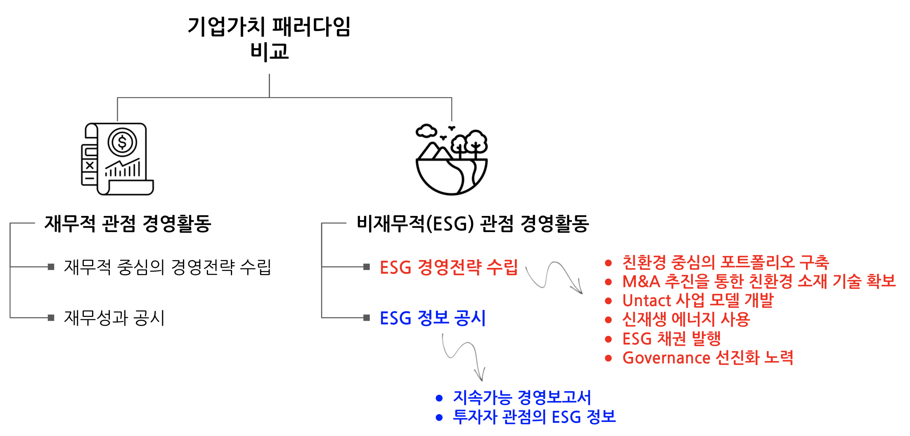
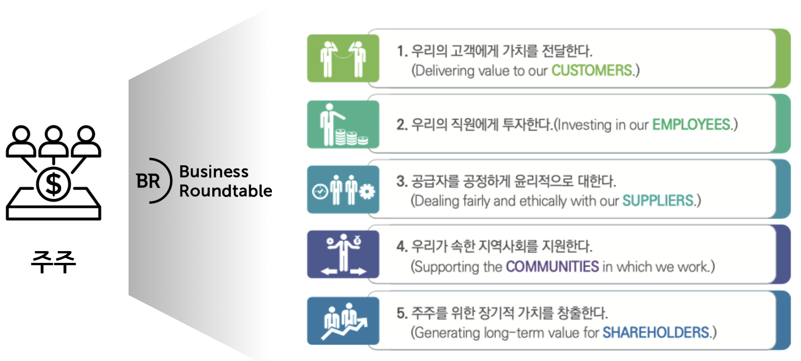
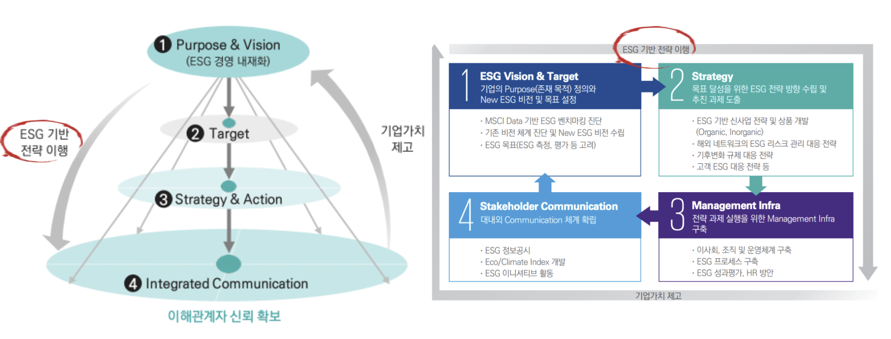
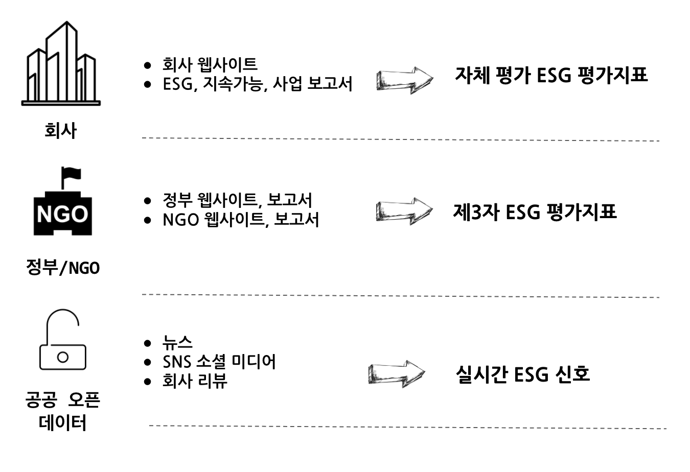
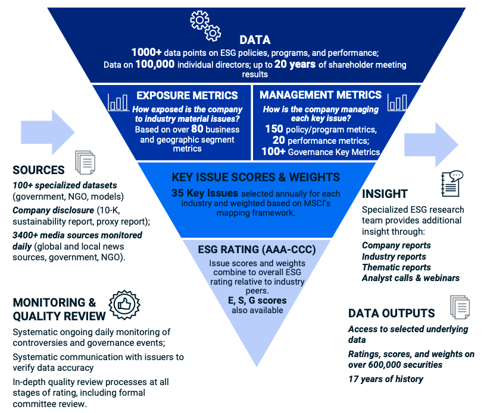
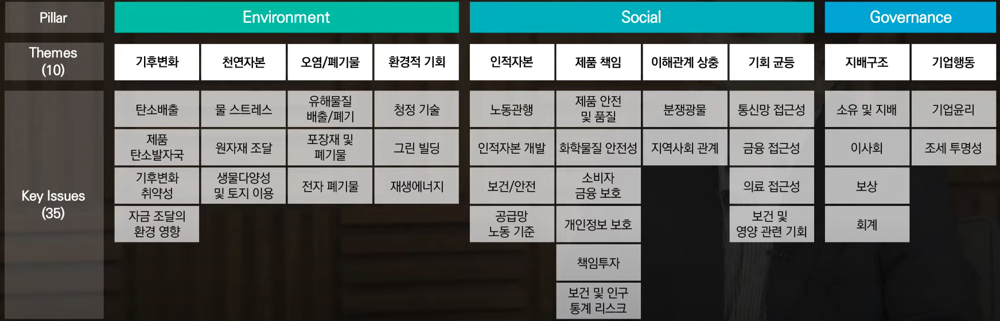
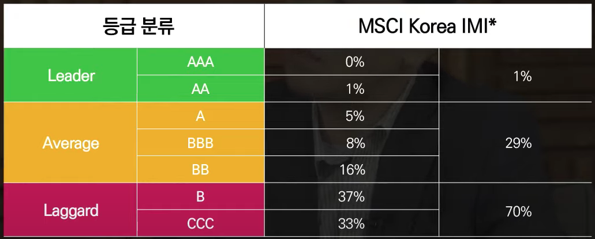
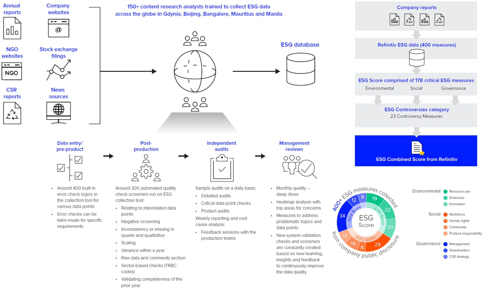
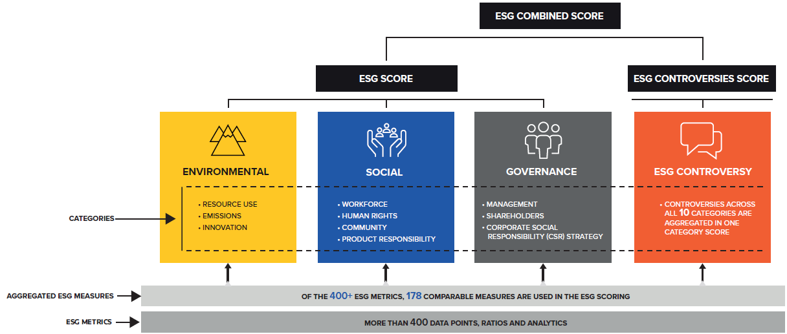

```{r setup, include=FALSE}
knitr::opts_chunk$set(echo = TRUE, message=FALSE, warning=FALSE,
                      comment="", digits = 3, tidy = FALSE, prompt = FALSE, fig.align = 'center')
```

```{=html}
<style>
div.blue { background-color:#e6f0ff; border-radius: 5px; padding: 10px;}
</style>
```
# 기업가치의 뉴패러다임 {#new-paradigm}

전통적으로 기업가치는 재무적 관점의 경영활동을 통해 측정되었다.
하지만 기업가치를 제고시킬 수 있는 새로운 ESG 경영 뉴패러다임이 부상하고 있다.
과거 재무적 관점의 경영활동이란 재무 중심의 경영전략을 수립하고 재무성과 공시를 한 생애주기라고 하면, 비재무적(ESG) 관점의 경영활동은 ESG 경영전략 수립과 ESG 정보 공시를 생애주기로 한다.



## 주주 {#ESG-shareholders}

BRT(Business RoundTable)는 미국에서 가장 영향력 있는 기업 CEO 약 200여 명으로 구성된 협의체로 2019년 BRT 선언에 제프 베이조스(아마존), 팀 쿡(애플), 메리 바라(GM), 제이미 다이먼(JP모건), 지니 로메티(IBM) 등 181명의 주요 기업 CEO들이 참여하여 주주에 대한 정의부터 다시 내렸다.



## ESG가 기업에게 중요한 이유 {#ESG-importance}

-   정부 ESG 규제 강화

    -   기업의 ESG 정보공시의무 강화
    -   2050년 탄소배출 넷제로(Net Zero) 달성을 위한 탄소감축 규제 강화 및 기업의 준수 노력

-   투자자의 ESG 요구 증대

    -   기업지배구조 개선 등을 도모하는 스튜어드십 코드 강화
    -   연기금과 자산운용사 등의 책임투자 및 ESG 투자 전략 활용 확대

-   기업평가에 ESG 반영

    -   글로벌 신용평가사, ESG 요소를 신용평가에 적극 반영

-   고객의 ESG 요구 증대

    -   공급망 관리와 협력업체 선정의 주요 요소로 부각되는 ESG
    -   MZ 세대 중심의 고객 ESG 요구 증대

## ESG 주요 사항 [^1] {#overview-of-ESG}

[^1]: [삼정KPMG 경제연구원 (2020), "ESG 경영 시대 전략 패러다임 대전환"](https://assets.kpmg/content/dam/kpmg/kr/pdf/2020/kr-esg-strategy-20201217.pdf)

코로나19에 따른 ESG 경영 트렌드는 가속화되고 있고 ESG 환경, 사회, 지배구조에 대한 주요 항목을 일별하면 다음과 같다.

```{r ESG-hierarchy}
library(collapsibleTree)
library(tidyverse)
library(colorspace)

esg_tbl <- tribble(~"ESG", ~"sub_ESG",
                   "환경", "기후변화, 탄소배출",
                   "환경", "환경오염",
                   "환경", "생물 다양성",
                   "환경", "자원 및 폐기물 관리",
                   "환경", "에너지 효율",
                   "환경", "물 부족",
                   "환경", "천연자원",
                   "사회", "고객만족",
                   "사회", "데이터보호,프라이버시",
                   "사회", "인권,성별 및 다양성",
                   "사회", "지역사회 관리",
                   "사회", "공급망 관리",
                   "사회", "제품책임",
                   "지배구조", "이사회 구성",
                   "지배구조", "감사위원회 구조",
                   "지배구조", "뇌물 및 부패",
                   "지배구조", "로비, 정치 기부금",
                   "지배구조", "기업윤리")

collapsibleTree(esg_tbl, 
                hierarchy  = c("ESG", "sub_ESG"),
                root       = "ESG",
                tooltip    = TRUE,
                attributes = "ESG",
                fill       = "#64ABC2",
                collapsed  = TRUE, 
                width      = 800,
                zoomable   = FALSE)
```

## ESG 추진전략 {#ESG-strategy}

기업의 비즈니스 리더는 기존의 경영체계를 "ESG 경영체계"로 디지털 전환과 발맞추어 재설계해야 한다.
우선 기업의 Purpose & Vision을 ESG 기준에 맞춰 재정립하고, 재무성과와 비재무성과를 통합한 새로운 목표를 수립하하과 이에 맞춰 목표달성을 위한 세부전략과제 도출을 위해 ESG 핵심 어젠다를 검토해야 되는데 비즈니스 리더가 주목할 ESG 경영 5대 어젠다로는 규제(Regulation), 파이낸싱(Financing), 인수합병(M&A), 기술(Tech), 보고(Reporting)가 제시되고 있다.
기업의 ESG 비전과 목표설정을 명확히 하고 상체 추진 전략 수립을 이행함으로써 기업가치를 제고 시키고 이를 ESG 정보공시, Eco/Climate Index 개발, ESG 이니셔티브 활동을 통해 대내외 ESG 커뮤니케이션도 강화해 나가야 된다.



# ESG 데이터 [^2] {#ESG-data}

[^2]: [Datarade (2019-11-21), "What is ESG Data and how to use it?"](https://www.youtube.com/watch?v=eOy8ztvhGYo)

ESG 데이터를 특정 회사를 기준으로 둔다면 회사 자체에 대한 ESG 평가지표는 회사 웹사이트, ESG 보고서, 지속가능 보고서, 재무제표가 포함된 사업보고서에 찾을 수 있는데 이런 경우 회사 자체 평가 ESG 평가지표가 주를 이룬다.
NGO 나 정부에서 제공하는 ESG 데이터는 NGO/정부 웹사이트나 보고서에서 찾을 수 있고 이런 경우 제3자 ESG 평가지표정보가 포함된다.
공공 오픈 데이터는 실시간 ESG 신호를 제공하는 특징이 있고 뉴스, SNS 소셜 미디어, 회사 리뷰 등을 통해 수집이 가능하다.



```{r esg-data-src}
esg_src_tbl <- tribble(~"ESG", ~"data",
                        "Environmental", "Carbon Emissions",
                        "Environmental", "Renewable Energy",
                        "Environmental", "Water Stress",
                        "Social", "Human Capital",
                        "Social", "Labor Statistics",
                        "Governance", "Business Ethics",
                        "Governance", "Corruption",
                        "Governance", "Board Stats")

collapsibleTree(esg_src_tbl, 
                hierarchy  = c("ESG", "data"),
                root       = "Business",
                tooltip    = TRUE,
                attributes = "ESG",
                fill       = "#64ABC2",
                collapsed  = TRUE, 
                width      = 800,
                zoomable   = FALSE)

```

# 글로벌 ESG 지표 {#global-esg-rating}

## MSCI {#msci}

MSCI 데이터 수집을 통해서 ESG 평가지표(AAA-CCC)를 제작하는 방식은 다음과 같다.



### MSCI ESG 계층도 {#msci-esg-hiearchy}



```{r msci-esg-data-src}
msci_tbl <- tribble(~"Pillar", ~"Theme", ~"Key Issues",
                        "Environmental", "Climate Change", "Carbon Emissions",
                        "Environmental", "Climate Change", "Product Carbon Footprint",
                        "Environmental", "Climate Change", "Financing Environmental Impact",
                        "Environmental", "Climate Change", "Climate Change Vulnerability",
                        "Environmental", "Natural Capital", "Water Stress",
                        "Environmental", "Natural Capital", "Raw Material Sourcing",
                        "Environmental", "Natural Capital", "Biodiversity & Land Use",
                        "Environmental", "Pollution & Waste", "Toxic Emissions & Waste",
                        "Environmental", "Pollution & Waste", "Electronic Waste",
                        "Environmental", "Pollution & Waste", "Packaging Material & Waste",
                        "Environmental", "Environmental Opportunities", "Opportunities in Clean Tech",
                        "Environmental", "Environmental Opportunities", "Opportunities in Green Building",
                        "Environmental", "Environmental Opportunities", "Opportunities in Renewable Energy",
                        "Social", "Human Capital", "Labor Management",
                        "Social", "Human Capital", "Human Capital Development",
                        "Social", "Human Capital", "Health & Safety", 
                        "Social", "Human Capital", "Supply Chain Labor Standards",
                        "Social", "Product Liability", "Product Safety & Quality",
                        "Social", "Product Liability", "Chemical Safety",
                        "Social", "Product Liability", "Financial Product Safety",
                        "Social", "Product Liability", "Privacy & Data Security",
                        "Social", "Product Liability", "Responsible Investment",
                        "Social", "Product Liability", "Health & Demographic Risk",
                        "Social", "Stakeholder Opposition", "Controversial Sourcing",
                        "Social", "Stakeholder Opposition", "Community Relations",
                        "Social", "Social Opportunities", "Access to Communications",
                        "Social", "Social Opportunities", "Access to Finance",
                        "Social", "Social Opportunities", "Access to Health Care",
                        "Social", "Social Opportunities", "Opportunities in Nutrition & Health",
                        "Governance", "Corporate Governance", "Ownership & Control",
                        "Governance", "Corporate Governance", "Board",
                        "Governance", "Corporate Governance", "Pay",
                        "Governance", "Corporate Governance", "Accounting",
                        "Governance", "Corporate Behavior", "Business Ethics",
                        "Governance", "Corporate Behavior", "Tax Transparency")

collapsibleTree(msci_tbl, 
                hierarchy  = c("Pillar", "Theme", "Key Issues"),
                root       = "MSCI",
                tooltip    = TRUE,
                attributes = "Pillar",
                fill       = "#64ABC2",
                collapsed  = TRUE, 
                width      = 800,
                zoomable   = FALSE)

```

### MSCI ESG 기업평가 {#esg-korea-rating}



## Refinitiv [^refinitiv] {#refinitiv}

[^refinitiv]: [REFINITV, "Sustainable finance"](https://www.refinitiv.com/en/sustainable-finance)



### Refinitiv ESG 계층도


## 무디스 {#moodys}

# 한국 ESG 지표 {#korean-esg}

## 행복경제연구소 [^esg-happinness] {#happiness-lab}

[^esg-happinness]: [연합뉴스 (2021-02-25), "ESG행복경제연구소, 국내 시총 50개 사 'ESG 평가 지수' 나왔다"](https://www.yna.co.kr/view/RPR20210225002300353)

ESG행복경제연구소 ESG지수는 기업의 환경(E)·사회(S)·지배구조(G) 수준을 각각 4:3:3 비중으로 나눠 평가한다.


## 지속가능발전소 [^esg-plan] {#substainable-plant}

[^esg-plan]: [매일경제, (2021.02.01)"100대 상장사 ESG점수 3년째 제자리"](https://m.stock.naver.com/item/main.nhn#/stocks/019170/news/0004742849/office/009)

## 지배구조연구원 {#esg-cgs}


```{r get-rating-data, eval = FALSE}
library(tidyverse)
library(rvest)

cgs_url <- "http://www.cgs.or.kr/business/esg_tab04.jsp?"

# Sys.setlocale("LC_ALL", locale = "C")

crawl_cgs <- function(page_num) {
  cgs_crawl_page <- glue::glue("{cgs_url}pg={page_num}&pp=10&skey=&svalue=&sfyear=2020&styear=2020&sgtype=&sgrade=#ui_contents")
  
  esg_tbl <- cgs_crawl_page %>% 
    # read_html(encoding = "UTF-8") %>%
    read_html(encoding = "utf-8.") %>%
    html_nodes(xpath = '//*[@id="ui_contents"]/div[2]/div[3]/table') %>% 
    html_table() %>% 
    .[[1]]
  
  cat("Page Number", page_num, "\n")
  Sys.sleep(runif(1))
  return(esg_tbl)
}

# Sys.setlocale("LC_ALL", locale = "Korean")

# esg_tbl <- map_df(1:3, crawl_cgs)
esg_tbl <- map_df(1:97, crawl_cgs)

esg_tbl %>% 
  write_csv("data/esg_rating.csv")

```


